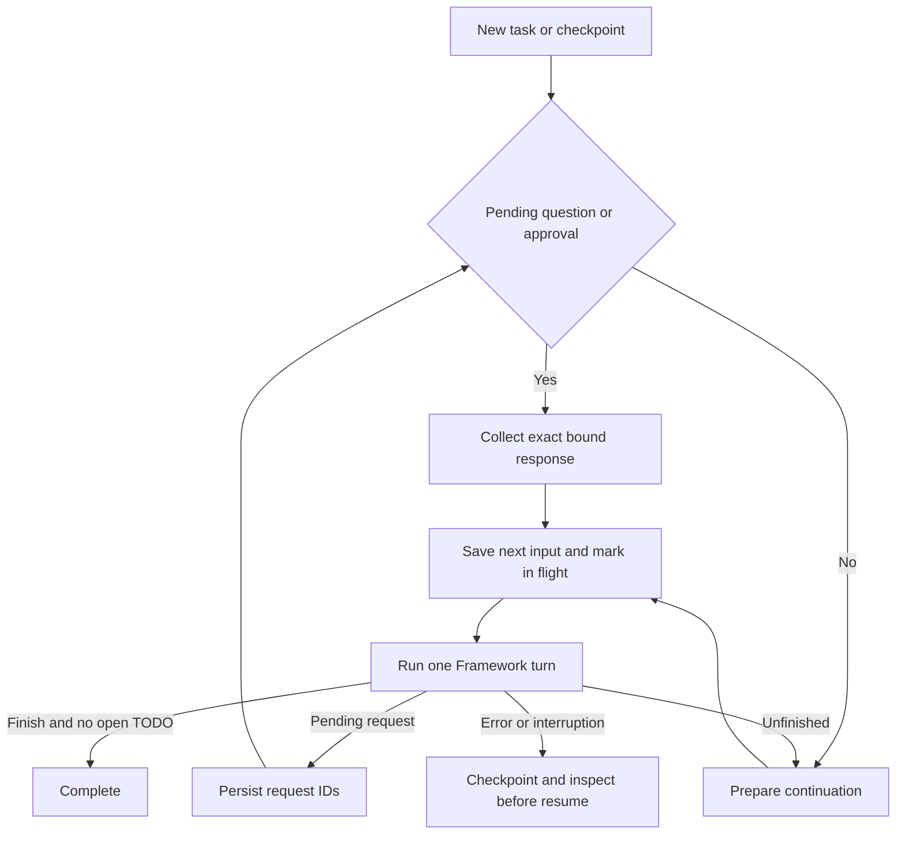

# Small host supervisor

The sample keeps three source files and Framework 1.17.0/provider 1.14.2. One
session-scoped host supervisor coordinates ordinary Framework turns.

Pending requests are serialized before terminal input. Restart re-presents the
original call ID. Collected responses are saved before use. An in-flight input is
never blindly replayed: recovery inspects current state and obtains necessary
approval again. This reduces duplication risk but is not crash-atomic file execution.

`MAF_API_RETRIES` controls SDK HTTP attempts per model request. It no longer repeats
an entire `agent.run()` after a tool may have changed a file.
`MAF_REQUEST_TIMEOUT_SECONDS` bounds HTTP calls. Terminal turn failures retain the
existing choices to inspect/continue, steer, or suspend.

Premature `task_finish` state is cleared; completing the TODOs later requires a
fresh completion declaration. New tasks reset TODOs. Completed checkpoints close
without another model invocation. Host plan mode rejects file mutations even when
approval was otherwise provided. Existing write/delete approval and workspace
boundaries remain.

Tests use a local OpenAI-compatible endpoint and scripted turns for restart,
completion and retry behavior; they require no external model credentials.
